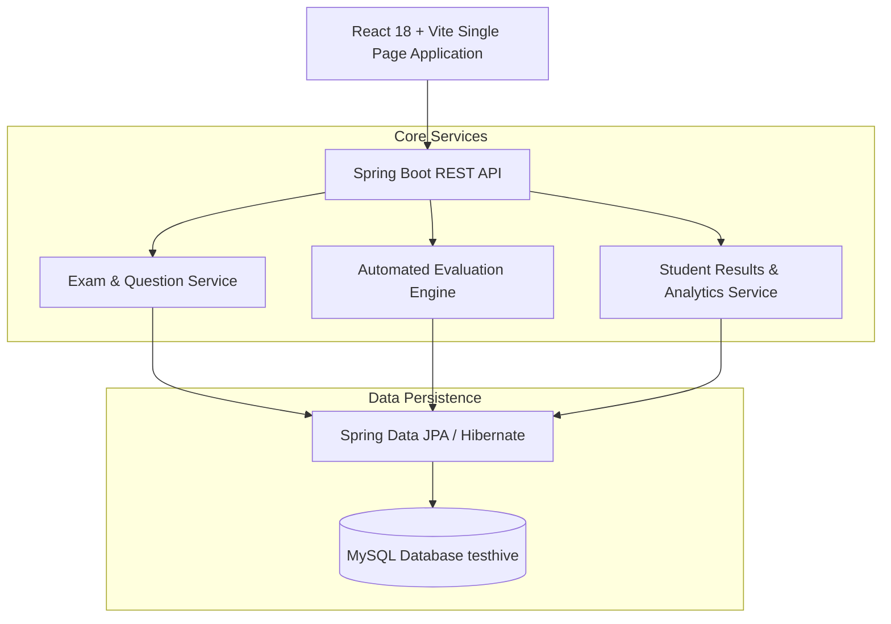

# TestHive — Full-Stack Online Examination Platform

> **Status**: 🔵 Completed / Portfolio Maintained  
> **Target Identity**: TestHive  
> **License**: MIT License ([LICENSE](LICENSE))  

TestHive is a full-stack online examination and assessment platform built with **React**, **Spring Boot**, **Spring Data JPA**, and **MySQL**.

---

## Overview

Educational institutions and testing centers require secure, automated platforms to construct question banks, deliver timed examinations, automatically evaluate student submissions, and generate performance analytics. **TestHive** decouples a modern React 18 frontend from a robust Spring Boot REST API service.

---

## Why I Built It

I built TestHive to explore full-stack web application development, relational schema design for complex exam structures, state management during timed browser assessments, and automated test evaluation algorithms. Building TestHive required handling concurrent exam sessions, enforcing question-level constraints, and delivering instant score calculation.

---

## Architecture & Data Flow



---

## Key Features & Systems Design

- **Question Bank Management**: Supports multiple-choice questions (MCQs), category tags, difficulty levels, and solution keys.
- **Timed Student Assessment Portal**: Interactive exam interface with real-time countdown timers, question palette navigation, and auto-submission on timer expiry.
- **Automated Evaluation Engine**: Instantly grades completed exams, calculates overall percentages, and generates detailed subject breakdown reports.
- **Teacher & Admin Dashboard**: Exam scheduling, student enrollment management, and class performance analytics.
- **Decoupled REST API Architecture**: Clean separation between Spring Boot backend services and React frontend UI components.

---

## Technical Stack

| Layer | Technologies |
|---|---|
| **Backend Framework** | Java 17, Spring Boot 3.x, Spring MVC |
| **Data & Persistence** | Spring Data JPA, Hibernate, MySQL Connector/J |
| **Frontend Framework** | React 18, Vite, Axios, React Router |
| **Build & Tooling** | Apache Maven, npm, ESLint |

---

## Repository Structure

```
TestHive/
├── testhive-backend/
│   ├── pom.xml                 # Maven build dependencies
│   └── src/main/
│       ├── java/com/testhive/  # Spring Boot controllers, entities, & services
│       └── resources/
│           └── application.properties # Spring configuration with env defaults
├── testhive-frontend/
│   ├── package.json            # React frontend dependencies
│   ├── vite.config.js          # Vite configuration
│   └── src/                    # Components, pages, & API services
├── .env.example                # Safe environment variable configuration template
├── .gitignore                  # Git untracked files rules
├── LICENSE                     # MIT License
└── README.md                   # Project documentation
```

---

## Installation & Setup

### Prerequisites
- Java 17+
- MySQL 8.0+
- Node.js 18+

### 1. Create MySQL Database

```sql
CREATE DATABASE testhive;
```

### 2. Configure Environment

Copy `.env.example` to set custom database credentials if needed:

```bash
cp .env.example .env
```

### 3. Start Backend Service

```bash
cd testhive-backend
mvn clean install
mvn spring-boot:run
```

The Spring Boot backend API will run at `http://localhost:8080`.

### 4. Start Frontend Application

In a separate terminal:

```bash
cd testhive-frontend
npm install
npm run dev
```

The React frontend will run at `http://localhost:5173`.

---

## Limitations

- **Educational & Portfolio Purpose**: Designed for educational demonstration and full-stack engineering portfolio presentation.
- **Browser Security**: Relies on frontend JavaScript timers for countdown display; production high-stakes testing systems incorporate browser proctoring and server-side socket timers.

---

## License

This project is licensed under the MIT License — see the [`LICENSE`](LICENSE) file for details.
